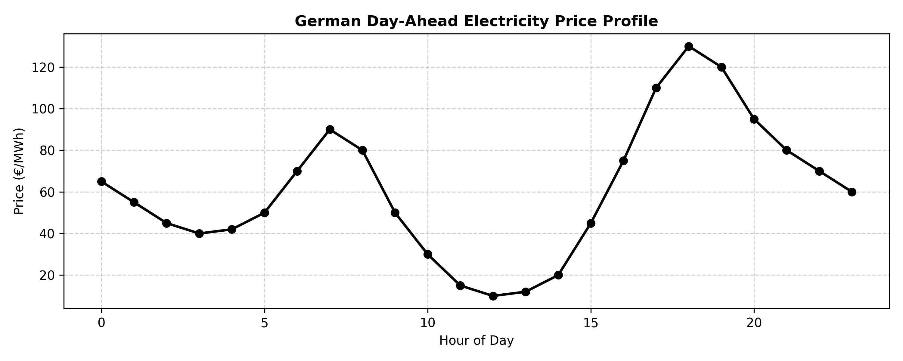
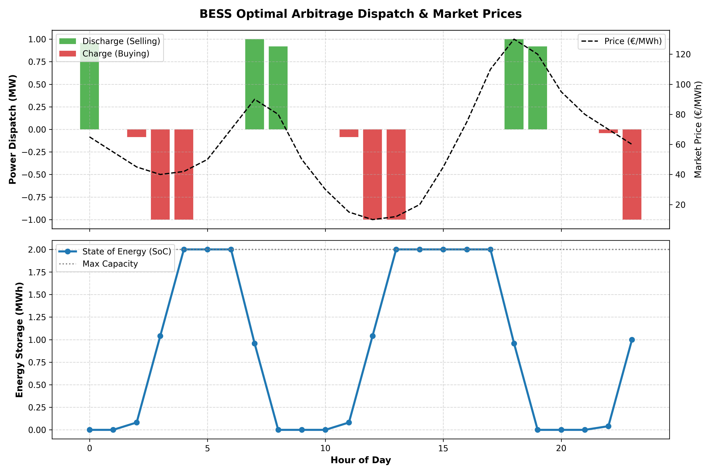

# ⚡ Grid-Nexus BESS Optimizer

[](https://grid-nexus-bess-optimizer-b8by7r8hfzkdh2uvnv7skk.streamlit.app/)
[](https://www.python.org/)
[](https://opensource.org/licenses/MIT)

An advanced Mixed-Integer Linear Programming (MILP) optimization engine designed for Battery Energy Storage Systems (BESS) market arbitrage in the German Day-Ahead electricity market.

---

## 🚀 Live Demo
Experience the interactive web application deployed on Streamlit Cloud: 
👉 **[Grid-Nexus BESS Optimizer App](https://grid-nexus-bess-optimizer-b8by7r8hfzkdh2uvnv7skk.streamlit.app/)**

---

## 📊 Visuals & Outputs

### Market Price Profile (Day-Ahead)


### BESS Optimal Dispatch & State of Charge (SoC)


---

## 🛠️ Key Features
- **MILP Optimization Engine:** Formulates and solves a Mixed-Integer Linear Program using PuLP to maximize daily revenue through energy arbitrage (buying low, selling high).
- **Physical Constraints Management:** Strictly respects battery capacity, maximum C-rates, charging/discharging efficiencies, and State of Charge (SoC) boundary limits.
- **Interactive Dashboard:** A clean, user-friendly Streamlit interface for adjusting parameters, running simulations, and visualizing dispatch strategies.
- **Automated Testing Suite:** Integrated unit tests using `pytest` to ensure robust mathematical modeling and solver reliability.

---

## 📂 Repository Structure
```text
grid-nexus-bess-optimizer/
├── data/
│   └── entsoe_prices_sample.csv
├── outputs/
│   ├── bess_dispatch_chart.png
│   ├── market_prices.csv
│   ├── market_prices_chart.png
│   └── optimization_results.csv
├── src/
│   └── optimization_engine.py
├── tests/
│   └── test_optimizer.py
├── app.py
├── requirements.txt
└── README.md
